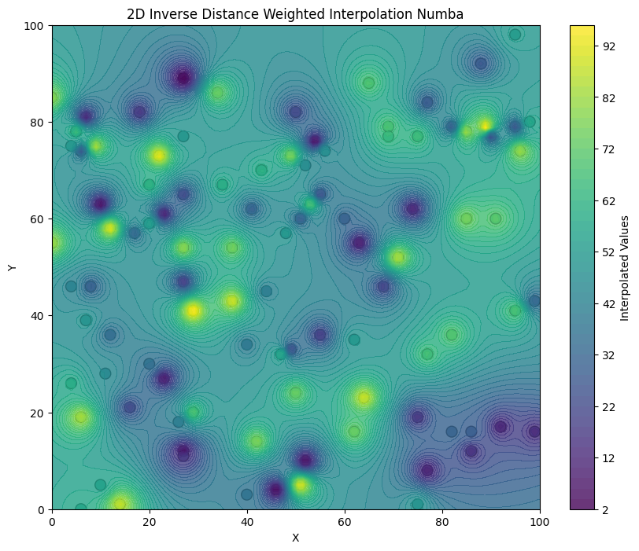

# Метод обратных расстояний с использованием Numba
 Результаты замера времени:
 
| N | Pure Python | Numba |
| - | - | - |
| 10 | 250 ms | 281 ms |
| 100 | 2.05 s | 297 ms |
| 1000 | 20.4 s | 438 ms |

